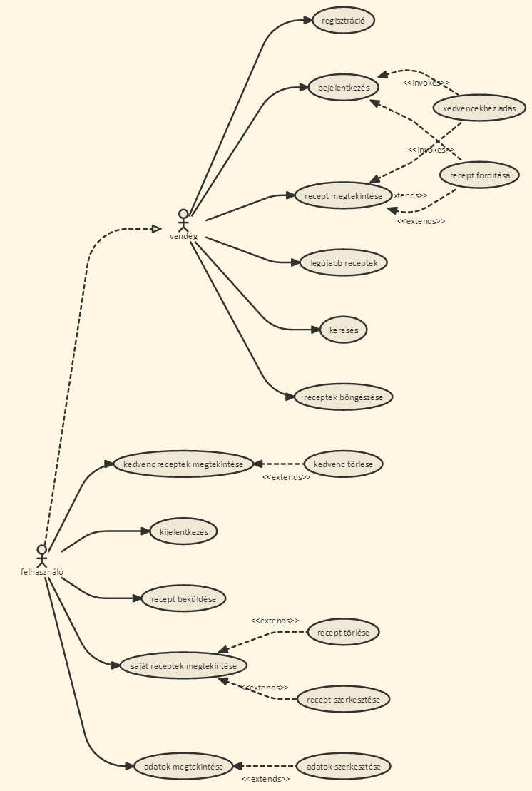

# Receptek és hozzávalók
Alkalmazások fejlesztése 2/3 beadandó

## Funkcionális követelmények
#### Vendég (nem bejelentkezett látogató):
* bejelentkezés
* egy recept megtekintése
* 10 legújabb recept megtekintése
* receptek böngészése
* receptek (angol és magyar) leírásának, hozzávalóinak megtekintése 
* receptek keresése
* honlapra való regisztráció, ami új dolgokkal/funkciókkal látja el a felhasználót

#### Bejelentkezett felhasználó:
* saját receptek listájának megtekintése
* kedvenc receptek listájának megtekintése
* egy recept felvétele a kedvenc receptekhez
* recept törlése a kedvencek közül
* saját recept beküldése hozzávalókkal és leírással (angolul és magyarul)
* saját recept törlése
* saját felhasználói adatok megtekintése és szerkesztése
* receptek fordítása angolra

## Nem funkcionális követelmények
* biztonság: jelszavak, e-mail címek tárolása - nem autorizált felhasználó ne férjen hozzá egy felhasználó adataihoz és autorizácóhoz kötött funkciókhoz sem
* egyszerű, érthető, felhasználóbarát felület
* gyors működés

## Szakterületi fogalomjegyzék
* recept:
    * étel elkészítéséhez szükséges hozzávalók leírása
    * étel elkészítésének lépéseit tartalmazó részletes leírása
    * különböző mértékegységek megadása más mértékegységekben, ha a felhasználó úgy dönt le szeretne fordítani angolra egy receptet

## Szerepkörök
* vendég: receptek keresését, böngészését, megtekintését végezheti
* felhasználó: receptek létrehozását, keresését, böngészését, megtekintését, saját receptjeinek módositását (szerkesztése, törlése), receptek kedvencekhez való felvételét és kedvencekből való törlését, saját és más felhasználók által beküldött receptek hozzávalóinak, illetve leírásainak angolra fordítását végezheti

## Használati eset diagram (Use Case Diagram)


Link: [http://bit.ly/2g86BXh](http://bit.ly/2g86BXh)

## Folyamat diagramok
### Regisztracio


Link: [http://bit.ly/2fes81j](http://bit.ly/2fes81j)

### Bejelentkezés folyamata

Link: [http://bit.ly/2djnJWt](http://bit.ly/2djnJWt)

### Fiókadatok szerkesztése

Link: [http://bit.ly/2g8gg03](http://bit.ly/2g8gg03)

### Kedvencekhez adás folyamata

Link: [http://bit.ly/2dWjVki](http://bit.ly/2dWjVki)

### Kedvencekbol valo torles

Link: [http://bit.ly/2fevlht](http://bit.ly/2fevlht)

Megjegyzés: Nem muszáj a kedvencek menüpontra kattintani, ahhoz, hogy töröljünk egy receptet a kedvencek közül. Ha egy recept oldalára megyünk a főoldalról (vagy barhonnét máshol) és látjuk, hogy a recept már a kedvencekhez fel lett véve, akkor ezáltal a folyamat által is törölni tudjuk.

### Új recept felvételének folyamata

Link: [http://bit.ly/2fewwx5](http://bit.ly/2fewwx5)

### Receptek fordításának folyamata

Link: [http://bit.ly/2guy6hb](http://bit.ly/2guy6hb)

### Recept szerkesztesenek folyamata

Link: [http://bit.ly/2frtWl2](http://bit.ly/2frtWl2)

## Architektúra terv

#### Oldaltérkép

Publikus:

* Főoldal
* Receptek böngészése
	* Recept megtekintése
		* Recept fordítása (látható opció, de bejelentkezésre készteti a felhasználót)
* Keresés
* Belépés
* Regisztráció

Felhasználó

* Saját receptek megtekintése
* Receptek böngészése
	* Recept megtekintése
		* Recept kedvencekhez felvétele
		* Recept szerkesztése
		* Recept törlése (ha a felhasználóé a recept)
		* Recept fordítása
* Kedvenc receptek megtekintése
* Fiókadatok megtekintése
	* Fiókadatok szerkesztése
* Kijelentkezés

#### Végpontok

```GET /``` : főoldal

```GET /all``` : receptek böngészésének oldala

```GET /login``` : bejelentkező oldal

```POST /login``` : bejelentkező oldal adatainak elküldése

```GET /create``` : recept létrehozásának oldala

```POST /create``` : recept létrehozásának adatainak elküldése

```GET /recipe/:id``` : egy recept oldala

```GET /recipe/:id/edit``` : egy recept szerkesztőjének oldala

```POST /recipe/:id/edit``` : egy recept szerkesztőjének az adatainak elküldése 

```POST /recipe/:id/delete``` : egy törlendő recept adatainak elküldése (recept törlése)

```GET /recipe/:id/translate``` : egy recept fordítójának oldala

```POST /recipe/:id/translate``` : egy recept fordítójának az adatainak elküldése

```GET /register``` : regisztrációs oldal

```POST /register``` : regisztráció adatainak elküldése

```GET /logout``` : felhasználó kijelentkeztetése

```POST /search``` : keresendő kifejezés elküldése

```GET /search``` : keresési találatok oldala

```GET /account``` : fiókadatok oldala

```GET /editaccount``` : fiókadatok szerkesztőjének oldala

```POST /editaccount``` : fiókadatok szerkesztőjének az adatainak elküldése

```GET /myrecipes``` : saját receptek oldala

```GET /myfavorites``` : kedvenc receptek oldala

```POST /recipe/:id/favorite``` : recept kedvencekbe tevése

```POST /recipe/:id/removeFavorite``` : recept kedvencekből való törlése

```GET /error``` : hibaoldal

## Felhasználóifelület-modell

#### Oldalvázlatok


## Osztálymodell

#### Adatmodell


#### Adatbázisterv


## Implementáció

#### Fejlesztőkörnyezet

* Lokális
* Visual Studio Code
	* parancssor
* Böngésző

#### Keretrendszer

* AdonisJS

## Felhasználói dokumentáció

#### A futtatáshoz ajánlott hardver-, szoftver konfiguráció

Windows 7 vagy újabb operációs rendszer, Visual Studio Code v1.5.3, NodeJS v6.9.1, npmJS v3.10.8, AdonisJS

#### Telepítés lépései: hogyan kerül a Githubról a célgépre a program, hogyan kell elindítani

1. Projekt letöltése a számítógépre:
	A GitHub repository oldalán kattintsunk a "Clone or download" gombra, majd válasszuk ki a "Download ZIP" opciót. Ezután csomagoljuk ki egy kívánt helyre a letöltött fájlt.
2. Program elindítása:
	Nyissuk meg a Visual Studio Code-ot és kattintsunk a File > Open Folder menüpontra és válasszuk ki a mappát, amibe az első lépésben kicsomagoltuk a projektet. Ezután nyissuk meg a Visual Studio Code-on belül a Terminal-t (View > Integrated Terminal). 

	Az alábbi sorrendben írjuk be a parancsokat a parancssorba és várjunk, míg lefutnak.

	```npm install```

	```npm update```

	```npm install express-admin```
	
	Ezután a honlap elindításához írjuk be a parancssorba, hogy ```npm run dev``` és a ```localhost:3333``` címen máris elérhető a honlap. Ha az adatbázisban szeretnénk manuálisan szerkeszteni valamit, amit a honlapon nem lehet (például új kategória felvétele), nyissunk meg egy új Terminal-t a "+" gombra kattintva a jelenlegi Terminal ablakon belül és írjuk be az új parancssorba, hogy ```node_modules\.bin\admin config\express-admin``` és a ```localhost:4444``` címen elérhető lesz az adatbázis. Az adatbázisba való bejelentkezéshez szükséges adatok: ```Username: admin, Password: ADmin11```

Példafelhasználó adatai (a program elindításakor segítségképp ez a felhasználó már lehet, hogy be van jelentkezve): ```E-mail: p@p.com, Jelszó: jjjjj```

A fentebb említett instrukciók során feltételezzük, hogy az npmJS, nodeJS (és AdonisJS) legfrissebb verziói telepítve vannak.

#### A program használata

A weboldal megnyitásakor (ezesetben localhost:3333) a főoldal jelenik meg, ahol megtekinthetjük a 10 legújabb receptet. Ezek közül bármelyikre kattintva az adott recept oldalára jutunk, ahol láthatjuk a recept nevét és leírását (angolul és magyarul egyaránt). Ha a receptnek nincsen angol leírása, akkor lehetőségünk van lefordítani a receptet a "Lefordítom!" gombra kattintva a recept alatt. Ezt a gombot vendégek és bejelentkezett felhasználók is látják, viszont funkcióit csak bejelentkezett felhasználók tudják kihasználni. Amikor rákattintunk a "Lefordítom!" gombra, két lehetségés kimenet van: a) a felhasználó vendég: ekkor egy hibaüzenet jelenik meg, ami közli a vendéggel, hogy csak bejelentkezett felhasználó fordíthat le egy receptet. b) a felhasználó fiókkal rendelkezik és be van jelentkezve: ekkor a gombra kattintás után a fordítófelület jelenik meg, ahol (segítségképpen) látható a recept magyar neve és magyar leírása, ezek a mezők viszont nem szerkeszthetőek. Alatta található a két szerkeszthető mező, a recept angol neve és angol leírása. Miután kitöltöttük a mezőket a megfelelő adatokkal, a "Recept fordítása" gombra kattintva elmentődik a recept, immár az angol névvel és leírással, és átirányítódunk a recept oldalára, ahol láthatjuk, hogyan néz ki a recept az angol verziójával együtt. 

Az "Új recept felvétele" menüpontra kattintva két opció lehetséges: a) a felhasználó vendég: ekkor a felhasználót egy hibaüzenet fogadja, ami közli a vendéggel, hogy csak bejelentkezett felhasználók hozhatnak létre új receptet. b) a felhasználónak van fiókja és be van jelentkezve: ekkor megjelenik a recept felvételére használt oldal, ahol megadhatjuk a recept (angol és/vagy magyar) nevét és leírását, illetve hogy milyen kategóriát szeretnénk választani a receptnek. Ezek közül a recept magyar nevének és leírásának, illetve a kategória megadása kötelező. Ellenkező esetben hibaüzenetet kapunk, ami megmondja, hogy mi volt a probléma a recept felvételével kapcsolatban. Miután felvettünk egy új receptet, a recept oldalára irányítódunk át, így láthatjuk hogyan néz ki az újonnan beküldött recept. 

A "Receptek böngészése" menüpontra kattintva láthatjuk az összes receptet kategóriákra bontva. Bármely receptre kattintva megtekinthetjük magát a receptet. A recept oldalának alján, ha egy felhasználó be van jelentkezve, akkor több gombot is láthat. Az első gomb a "Kedvencekhez adom", aminek segítségével a kedvenceinkhez adhatjuk a receptet. Ha már a kedvenceink közt van a recept, akkor ez a gomb "Törlöm a kedvencekből" felirattal jelenik meg, aminek használatát lejjebb részletesen kifejtve találhatja meg. A második gomb a "Recept szerkésztése" gomb, amire kattintva a receptszerkesztő oldalra jutunk. Itt ugyanazok érvényesek, mint új recept felvételekor. A harmadik gomb, amit láthatunk egy recept oldalán, a "Recept törlése" gomb, ami kizárólag csak azoknak a felhasználóknak jelenik meg, akié a recept.

A keresés mező kitöltésekor a "Kerésés" gombra kattintva a kerésési találatok oldalára jutunk. Ha a kerésési mező nem volt kitöltve, de a gombot megnyomjuk, akkor az összes receptet látjuk. A kerésés során oldalanként 5 db receptet tekinthetünk meg egy listában, a lap alján pedig a balra/jobbra-nyilakkal, illetve a számokkal navigálhatunk a találatok között.

A "Regisztráció" menüpontra kattintva értelemszerűen eljutunk a regisztrációs oldalra, ahol a mezők kitöltése után a "Regisztrálok!" gombra kattintva máris bekerül a vendég a rendszerbe, mint felhasználó fiókkal. A vezetéknév illetve keresztnév mezők kivételével minden mező kitöltése kötelező. A jelszónak minimum 5 karakternek kell lennie. Miután regisztráltunk, a "Bejelentkezés" gombra kattintva értelemszerűen bejelentkezhetünk. A gombra kattintva a bejelentkező oldalra jutunk, ahol az e-mail cím és a hozzátartozó jelszó megadásával tudunk bejelentkezni. Ha valami hiba lép fel a bejelentkezés során, akkor arról hibaüzenetet kapunk. Miután bejelentkezünk, újra a főoldalra kerülünk, ahol a jobb felső sarokban a nevünkre kattintva egy legördülő menü menüpontjai közül választhatunk. Az első menüpont a "Saját receptjeim", ahol megtekinthetjük az általunk beküldött recepteket egy listában, a receptek nevei mellett a recept kategóriájának nevével. Ha ki szeretnénk törölni egy saját receptet, akkor egyszerűen csak kattintsunk a receptre, majd a recept oldalán a "Recept törlése" gombra. Ez a gomb kizárólag annak a felhasználónak jelenik meg, akié az a recept. A legördülő menüben a második menüpont a "Kedvenceim", ahol megtekinthetjük a kedvenc receptjeink listáját. Ha törölni szeretnénk egy receptet a kedvenceink közül, akkor egyszerűen a receptre való kattintás után, a recept oldalán kattintsunk a "Törlöm a kedvencekből" gombra. A harmadik menüpont a "Fiók megtekintése", amire kattintva megtekinthetjük a fiókunk adatait (felhasználónév, vezetéknév, keresztnév, illetve e-mail). Ezek a mezők ezen az oldalon nem szerkeszthetőek. Ha szerkeszteni szeretnénk az adatainkat, akkor azt az "Adataim szerkésztése" gombra kattintva tehetjük meg. Itt minden mező szerkeszthető, beleértve a jelszót is. Miután szerkesztettük a kívánt mezőket, kattintsunk a "Változtatások mentése" gombra és frissül is minden változtatott adat. Ha esetleg olyan felhasználónevet vagy e-mailt választunk, amit már más választott, akkor hibaüzenetet kapunk, mert ezek az adatok minden felhasználóra nézve egyediek (ez érvényes a regisztrációkor is). Az utolsó menüpont a "Kijelentkezés", ahol értelemszerűen kijelentkezhetünk a fiókunkból. Erre a gombra kattintva visszakerülünk a főoldalra.

#### JavaScript funkciók

##### AJAX-os funkciók
1. Keresés (ajaxSearch): Ennek az AJAX-os funkciónal a segítségével a honlap bármelyik oldalán könnyen tudunk keresni a meglévő receptek között. Amint elkezdjük beirni a kivánt kifejezést a keresőmezőbe, a honlap segítségképpen automatikusan feldobja nekünk a lehetséges találatokat, igy nem kell rákattintanunk a keresés gombra. Érintett fájlok: ```routes.js```, ```RecipeController.js```, ```parent.njk```, ```search.js```

2. Bejelentkezés (ajaxLogin): Ennek a segítségével a honlap bármelyik oldalán könnyen be tudunk jelentkezni. A "Bejelentkezés" gombra kattintva előugrik egy ablak, és az ott található mezőkbe beirva az adatainkat könnyeden bejelentkezhetünk. Ha rányomtunk a bejelentkezés gombra, az oldal )menüsáv) automatikusan frissül, anélkül, hogy nekünk bármit is kellene tennünk. Érintett fájlok: ```routes.js```, ```UserController.js```, ```parent.njk```, ```login.js```

3. Törlés (ajaxDelete): Ennek a funkciónak a segítségével könnyedén törölhetjük bármelyik saját receptünket. A törölni kivánt recept oldalán a "Recept törlése" gombra kattintva felugrik egy ablak, mint megerősités, hogy biztosan törölni szeretnénk-e az adott receptet. Ha "Igen"-nel válaszoltunk, akkor a recept kitörlődik, megjelenik egy sikerüzenet és átirányítódunk a főoldalra. Érintett fájlok: ```routes.js```, ```RecipeController.js```, ```show.njk```, ```delete.js```

##### Egyéb JavaScript funkciók
1. Magyar hozzávalók: a create.njk fájlban szereplő JavaScript kód segítségével új recept létrehozásakor külön mezőkbe irhatjuk a magyar receptek hozzávalóit és azok mennyiségét. A plusz gombra kattintva vehetunk fel új hozzávalókat, a hozzávalók mezői mellett lévő X gombra kattintva pedig törölhetjük azokat. A hozzávalók beviteli formátuma tetszőleges, a kódban látható, hogy egy ";" fogja elválasztani a hozzávalókat. Érintett fájlok: ```create.njk```

2. Angol hozzávalók: a create.njk fájlban szereplő JavaScript kód segítségével új recept létrehozásakor külön mezőkbe irhatjuk az angol receptek hozzávalóit és azok mennyiségét. A plusz gombra kattintva vehetunk fel új hozzávalókat, a hozzávalók mezői mellett lévő X gombra kattintva pedig törölhetjük azokat. A hozzávalók beviteli formátuma tetszőleges, a kódban látható, hogy egy ";" fogja elválasztani a hozzávalókat. Érintett fájlok: ```create.njk```

3. Hozzávalók formázása: a show.njk fájlban található kódban látható, hogy a szebb megjelenités érdekében a receptek hozzávalóiban szereplő ";" karaktereket két sortörésre cseréljük. Érintett fájlok: ```show.njk```

4. Angol recept megjelenitése/elrejtése: Egy recept oldalán az angol verzió automatikusan el van rejtve a tisztább megjelenésért. Az oldalon található egy "Show/hide English version" gomb, amire kattintva értelemszerűen megjelenik illetve elrejtődik az angol leirása az adott receptnek. Érintett fájlok: ```show.njk```

## Tesztelés

#### Selenium IDE

* Telepítés: [Erre a linkre](https://addons.mozilla.org/hu/firefox/addon/selenium-ide/) kattintva telepíthetjük a Selenium IDE kiegészitőt a Mozzilla Firefox böngészőnkhöz. A teszteléshez ez a böngésző és ez a kiegészitő használatos.

* Futtatás: Firefox-ban a Selenium IDE ikonra kattintva a felugró ablakban kattintsunk a File, majd Open menüpontra és nyissuk meg a "test" mappában lévő "8" nevű fájlt. Ha nem a legelső test case van kijelölve, akkor duplán kattintsunk a "Bejelentkezes"-re az oldalsavban. Ezután az automatikus teszt elinditasahoz kattintsunk a "Play entire test suite" gombra.

##### Tesztesetek

A Selenium IDE segítségével az alábbi eseteket teszteltük:

:white_check_mark: Bejelentkezés: a főoldalt meglátogatva nincsen éppen bejelentkezett felhasználó, igy a "Bejelentkezés" linkre kattintva a felugró ablakba beirjuk az adatainkat és megnyomjuk a bejelentkezéshez használt gombot.

:white_check_mark: Fiókadatok szerkesztése: Rákattintunk a menüsávban a nevünkre, a legördülő menüben az "Adataim" menüpontra, majd az "Adataim szerkesztése" gombra. A megjelenő oldalon kitöltjük a mezőket a megfelelől adatokkal (lsd. Selenium) majd rákattintunk a "Mentés" gombra.

:white_check_mark: Új recept felvétele: A főoldalon rákattintunk az "Új recept felvétele" linkre, és a megjelenő oldalon kitöltjük a mezőket a megfelelő adatokkal (lsd. Selenium) majd rákattintunk a "Recept felvétele" gombra. 

:white_check_mark: Recept kedvencekhez vétele és kedvencekből törlése: A létrehozott receptre kattintva láthatjuk a recept oldalát, az oldal alján rákattintunk a "Kedvencekhez" gombra majd pedig az ezáltal megjelenő oldalon lévő "Kedvenceim megtekintése" gombra.

:white_check_mark: Kedvencekből való törlés és vissza a recepthez: A kedvenc receptjeink megtekintésre szolgáló linkre kattintva a megjelenő oldalon rákattintunk az újonnan kedvencekhez vett receptre, és annak az oldalnak az alján a "Törlés a kedvencekből" gombra, majd pedig az ezáltal megjelenő oldalon a "Vissza a recepthez" gombra.

:white_check_mark: Recept szerkesztése: Rákattintunk az újonnan létrehozott receptünkre, a recept oldalának alján pedig a "Recept szerkesztése" gombra. A megjelenő oldalon lévő mezőket kitöltjük a megfelelő adatokkal (lsd. Selenium) majd rákattintunk a "Mentés" gombra.

:white_check_mark: Recept törlése: A főoldalon rákattintunk az újonnan létrehozott receptünkre, majd pedig a recept oldalánal az alján a "Recept törlése" gombra, a felugró megerősitő ablakban pedig az "Igen" gombra.