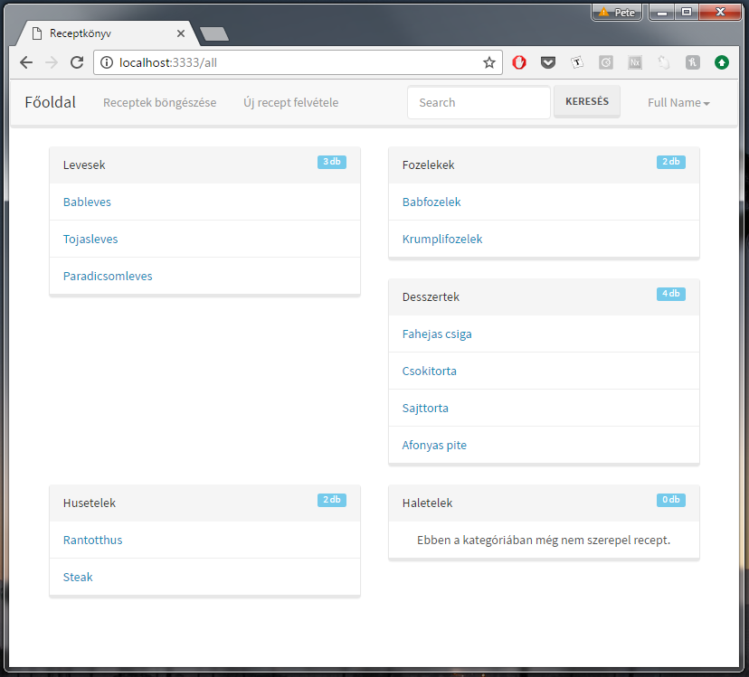

# Receptek és hozzávalók
Alkalmazások fejlesztése 2/3 beadandó

## Funkcionális követelmények
#### Vendég (nem bejelentkezett látogató):
* bejelentkezés
* 10 legújabb recept megtekintése
* receptek böngészése
* receptek (angol és magyar) leírásának, hozzávalóinak megtekintése 
* receptek keresése
* honlapra való regisztráció, ami új dolgokkal/funkciókkal látja el a felhasználót

#### Bejelentkezett felhasználó:
* saját receptek megtekintése
* egy recept felvétele a kedvenc receptekhez
* recept törlése a kedvencek közül
* saját recept beküldése hozzávalókkal és leírással (angolul és magyarul)
* saját recept törlése
* saját felhasználói adatok megtekintése és szerkesztése
* receptek fordítása angolra

## Nem funkcionális követelmények
* biztonság: jelszavak, e-mail címek tárolása - nem autorizált felhasználó ne férjen hozzá egy felhasználó adataihoz és autorizácóhoz kötött funkciókhoz sem
* egyszerű, érthető, felhasználóbarát felület
* gyors működés

## Szakterületi fogalomjegyzék
* recept:
    * étel elkészítéséhez szükséges hozzávalók leírása
    * étel elkészítésének lépéseit tartalmazó részletes leírása
    * különböző mértékegységek megadása más mértékegységekben, ha a felhasználó úgy dönt le szeretne fordítani angolra egy receptet

## Szerepkörök
* vendég: receptek keresését, böngészését, megtekintését végezheti
* felhasználó: receptek létrehozását, keresését, böngészését, megtekintését, saját receptjeinek módositását (szerkesztése, törlése), receptek kedvencekhez való felvételét és kedvencekből való törlését, más felhasználók által beküldött receptek hozzávalóinak, illetve leírásainak angolra fordítását végezheti

## Használati eset diagram (Use Case Diagram)

Link: [http://bit.ly/2g86BXh](http://bit.ly/2g86BXh)

## Folyamat diagramok
### Regisztracio

Link: [http://bit.ly/2fes81j](http://bit.ly/2fes81j)

### Bejelentkezés folyamata

Link: [http://bit.ly/2djnJWt](http://bit.ly/2djnJWt)

### Fiokadatok szerkesztese

Link: [http://bit.ly/2g8gg03](http://bit.ly/2g8gg03)

### Kedvencekhez adás folyamata

Link: [http://bit.ly/2dWjVki](http://bit.ly/2dWjVki)

### Kedvencekbol valo torles

Link: [http://bit.ly/2fevlht](http://bit.ly/2fevlht)
Megjegyzes: Nem muszaj a kedvencek menupontra kattintani, ahhoz, hogy toroljunk egy receptet a kedvencek kozul. Ha egy recept oldalara megyunk a fooldalrol (vagy barhonnet mashol) es latjuk, hogy a recept mar a kedvencekhez fel lett veve, akkor ezaltal a folyamat altal is torolni tudjuk.

### Új recept felvételének folyamata

Link: [http://bit.ly/2fewwx5](http://bit.ly/2fewwx5)

### Receptek fordításának folyamata

Link: [http://bit.ly/2guy6hb](http://bit.ly/2guy6hb)

### Recept szerkesztesenek folyamata

Link: [http://bit.ly/2frtWl2](http://bit.ly/2frtWl2)

## Architektura terv

#### Oldalterkep

Publikus:

* Fooldal
* Receptek bongeszese
	* Recept megtekintese
		* Recept forditasa (lathato opcio, de bejelentkezesre keszteti a felhasznalot)
* Kereses
* Belepes
* Regisztracio

Felhasználó

* Sajat receptek megtekintese
* Receptek bongeszese
	* Recept megtekintese
		* Recept szerkesztese (ha a felhasznaloe a recept)
		* Recept torlese (ha a felhasznaloe a recept)
* Kedvenc receptek megtekintese
* Fiokadatok megtekintese
	* Fiokadatok szerkesztese
* Kijelentkezes

#### Vegpontok

```GET /``` : fooldal

```GET /all``` : receptek bongeszesenek oldala

```GET /login``` : bejelentkezo oldal

```POST /login``` : bejelentkezo oldal adatainak elkuldese

```GET /create``` : recept letrehozasanak oldala

```POST /create``` : recept letrehozasanak adatainak elkuldese

```GET /recipe/:id``` : egy recept oldala

```GET /recipe/:id/edit``` : egy recept szerkesztojenek oldala

```POST /recipe/:id/edit``` : egy recept szerkesztojenek az adatainak elkuldese 

```POST /recipe/:id/delete``` : egy torlendo recept adatainak elkuldese (recept torlese)

```GET /recipe/:id/translate``` : egy recept forditojanak oldala

```POST /recipe/:id/translate``` : egy recept forditojanak az adatainak elkuldese

```GET /register``` : regisztracios oldal

```POST /register``` : regisztracio adatainak elkuldese

```GET /logout``` : felhasznalo kijelentkeztetese

```POST /search``` : keresendo kifejezes elkuldese

```GET /search``` : keresesi talalatok oldala

```GET /account``` : fiokadatok oldala

```GET /editaccount``` : fiokadatok szerkesztojenek oldala

```POST /editaccount``` : fiokatadok szerkesztojenek az adatainak elkuldese

```GET /myrecipes``` : sajat receptek oldala

```GET /myfavorites``` : kedvenc receptek oldala

```POST /recipe/:id/favorite``` : recept kedvencekbe tevese

```POST /recipe/:id/removeFavorite``` : recept kedvencekbol valo torlese

```GET /error``` : hibaoldal

## Felhasznaloifelulet-modell

#### Oldalvazlatok





## Osztalymodell

#### Adatmodell


#### Adatbazisterv


## Implementacio

#### Fejlesztokornyezet

* Lokalis
* Visual Studio Code
	* parancssor
* Bongeszo

#### Keretrendszer

* AdonisJS

## Felhasznaloi dokumentacio

#### A futtatáshoz ajánlott hardver-, szoftver konfiguráció

Windows operacios rendszer, Visual Studio Code, NodeJS, AdonisJS, npmJS

#### Telepítés lépései: hogyan kerül a Githubról a célgépre a program, hogyan kell elindítani

#### A program használata

A weboldal megnyitasakor (ezesetben localhost:3333) a fooldal jelenik meg, ahol megtekinthetjuk a 10 legujabb receptet. Ezek kozul barmelyikre kattintva az adott recept oldalara jutunk, ahol lathatjuk a recept nevet es leirasat (angolul es magyarul). Ha a receptnek nincsen angol leirasa, akkor lehetosegunk van leforditani a receptet a "Leforditom!" gombra kattintva a recept alatt. Ezt a gombot vendegek es bejelentkezett felhasznalok is latjak, viszont csak bejelentkezett felhasznalok tudjak kihasznalni. Amikor rakattintunk a "Leforditom!" gombra, ket lehetseges kimenet van: a) a felhasznalo vendeg: ekkor egy hibauzenet jelenik meg, ami kozli a vendeggel, hogy csak bejelentkezett felhasznalo fordithat le egy receptet. b) a felhasznalo fiokkal rendelkezik es be van jelentkezve: ekkor a gombra kattintas utan a forditofelulet jelenik meg, ahol (segitsegkeppen) lathato a recept magyar neve es magyar leirasa, ezek a mezok viszont nem szerkeszthetoek. Alatta talalhato a ket szekesztheto mezo, a recept angol neve es angol leirasa. Miutan kitoltottuk a mezoket a megfelelo adatokkal, a "Recept forditasa" gombra kattintva elmentodik a recept, immar az angol nevvel es leirassal, es atiranyitodunk a recept oldalara, ahol lathatjuk, hogyan nez ki az angol verzioja a receptnek. 

Az "Uj recept felvetele" menupontra kattintva ket opcio lehetseges: a) a felhasznalo vendeg: ekkor a felhasznalot egy hibauzenet fogadja, ami kozli a vendeggel, hogy csak bejelentkezett felhasznalok hozhatnak letre uj receptet. b) a felhasznalonak van fiokja es be van jelentkezve: ekkor megjelenik a recept felvetelere hasznalt oldal, ahol megadhatjuk a recept (angol es/vagy magyar) nevet es leirasat, illetve hogy milyen kategoriaba szeretnenk tenni a receptet. Ezek kozul a recept magyar nevenek es leirasanak, illetve a kategoria megadasa kotelezo. Ellenkezo esetben hibauzenetet kapunk, ami megmondja, hogy mi volt a problema a recept felvetelevel kapcsolatban. Miutan felvettunk egy uj receptet, a recept oldalara iranyitodunk at, igy lathatjuk hogyan nez ki az ujonnan bekuldott recept oldala. 

A "Receptek bongeszese" menupontra kattintva lathatjuk az osszes receptet kategoriakra bontva. Barmely receptre kattintva megtekinthetjuk magat a receptet. A recept oldalanak aljan, ha egy felhasznalo be van jelentkezve, akkor tobb gombot is lathat. Az elso gomb a "Kedvencekhez adom", aminek segitsegevel a kedvenceinkhez adhatjuk a receptet. Ha mar a kedvenceink kozt van a recept, akkor ez a gomb "Torlom a kedvencekbol" felirattal jelenik meg, aminek hasznalatat lentebb reszletesen kifejtve talalhatja meg. A masodik gomb a "Recept szerkesztese" gomb, amire kattintva a receptszerkeszto oldalra jutunk. Itt ugyanazok ervenyesek, mint uj recept felvetelekor. A harmadik gomb, amit lathatunk egy recept oldalan, a "Recept torlese" gomb, ami kizarolag csak azoknak a felhasznaloknak jelenik meg, akie a recept, amit eppen nezunk.

A kereses mezo kitoltesekor a "Kereses" gombra kattintva a keresesi talalatok oldalara jutunk. Ha a keresesi mezo nem volt kitoltve, de a gombot megnyomjuk, akkor az osszes receptet latjuk. A kereses soran oldalankent X db receptet tekinthetunk meg, a lap aljan pedig a balra/jobbra-nyilakkal, illetve a szamokkal navigalhatunk a talalatok kozott.

A "Regisztracio" menupontra kattintva ertelemszeruen eljutunk a regisztracios oldalra, ahol a mezok kitoltese utan a "Regisztralok!" gombra kattintva maris bekerul a vendeg a rendszerbe, mint felhasznalo fiokkal. A vezeteknev illetve keresztnev mezok kivetelevel minden mezo kitoltese kotelezo. A jelszonak minimum 5 karakternek kell lennie. Miutan regisztraltunk, a "Bejelentkezes" gombra kattintva ertelemszeruen bejelentkezhetunk. A gombra kattintva a bejelentkezo oldalra jutunk, ahol az e-mail cim es a hozzatartozo jelszo megadasaval tudunk bejelentkezni. Ha valami hiba lep fel a bejelentkezes soran, akkor arrol hibauzenetet kapunk. Miutan bejelentkezunk, ujra a fooldalra kerulunk, ahol a jobb felso sarokban a nevunkre kattintva egy legordulo menu menupontjai kozul valaszthatunk. Az elso menupont a "Sajat receptjeim", ahol megtekinthetjuk az altalunk bekuldott recepteket egy listaban, a receptek nevei mellett a recept kategoriajanak nevevel. Ha ki szeretnenk torolni egy sajat receptet, akkor egyszeruen csak kattintsunk a receptre, majd a recept oldalan a "Recept torlese" gombra. Ez a gomb kizarolag annak a felhasznalonak jelenik meg, akie az a recept. A legordulo menuben a masodik menupont a "Kedvenceim", ahol megtekinthetjuk a kedvenc receptjeink listajat. Ha torolni szeretnenk egy receptet a kedvenceink kozul, akkor egyszeruen a receptre valo kattintas utan, a recept oldalan kattintsunk a "Torlom a kedvencekbol" gombra. A harmadik menupont a "Fiok megtekintese", amire kattintva megtekinthetjuk a fiokunk adatait (felhasznalonev, vezeteknev, keresztnev, illetve e-mail). Ezek a mezok ezen az oldalon nem szerkeszthetoek. Ha szerkeszteni szeretnenk az adatainkat, akkor azt az "Adataim szerkesztese" gombra kattintva tehetjuk meg. Itt minden mezo szerkesztheto, beleertve a jelszot is. Miutan szerkesztettuk a kivant mezoket, kattintsunk a "Valtoztatasok mentese" gombra es frissult is minden valtoztatott adat. Ha esetleg olyan felhasznalonevet vagy e-mailt valasztunk, amit mar mas valasztott, akkor hibauzenetet kapunk, mert ezek az adatok minden felhasznalora nezve egyediek. Az utolso menupont a "Kijelentkezes", ahol ertelemszeruen kijelentkezhetunk a fiokunkbol. Erre a gombra kattintva visszakerulunk a fooldalra.